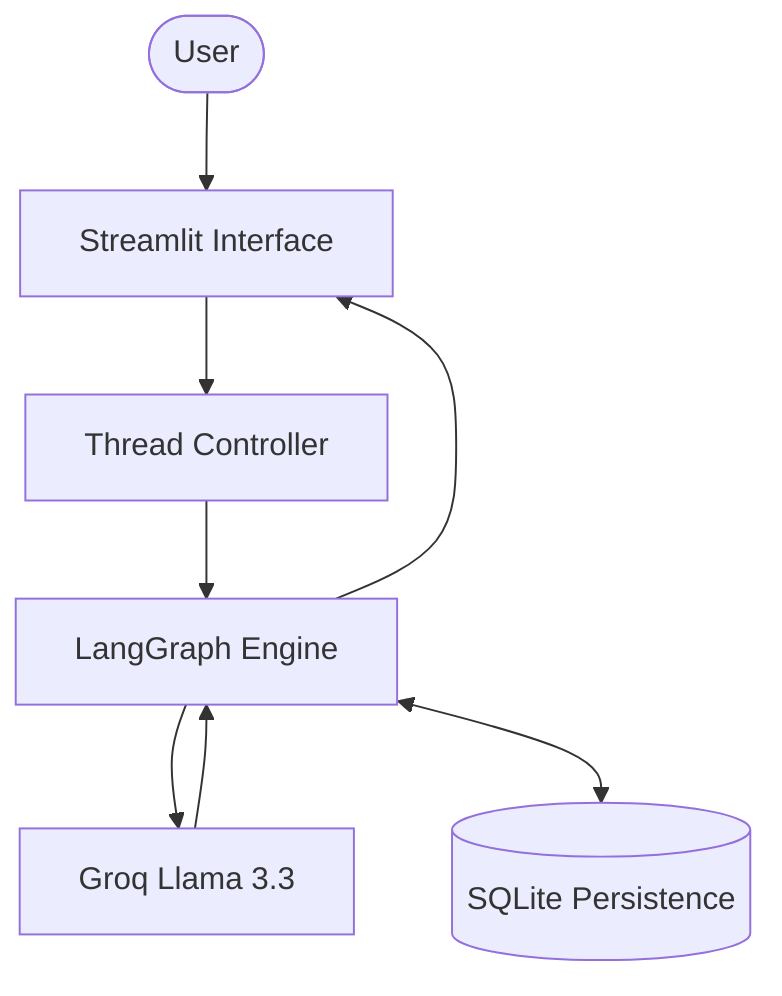

# 🤖 Intelligence Chatbot: Agentic AI with LangGraph

[](https://www.python.org/downloads/)
[](https://github.com/langchain-ai/langgraph)
[](https://streamlit.io/)
[](https://opensource.org/licenses/MIT)

A high-performance, stateful AI Chatbot built using **LangGraph**, **LangChain**, and **Streamlit**. This project demonstrates advanced LLM orchestration with persistent memory, thread management, and a premium user interface.

---

## 🌟 Key Features

- **🧠 State-Aware Orchestration**: Powered by LangGraph to maintain complex conversation flows and reliable state transitions.
- **💾 Advanced Persistence**: Full support for multi-thread conversations. Switching threads recovers the exact context, state, and history of that specific session.
- **⚡ Real-time Streaming**: Low-latency message streaming for a modern, fluid interactive experience.
- **📁 Dynamic History Management**:
    - **Session Persistence**: Automated thread saving using SQLite.
    - **Thread Switcher**: Intuitive sidebar to browse and resume past conversations.
    - **Instant Recovery**: Never lose a chat session even after a server restart.
- **🎨 Premium UI/UX**: Clean, responsive interface with optimized dark mode support.
- **🚀 Ultra-Fast Inference**: Integrated with **Groq (Llama 3.3-70b)** for near-instant responses.

---

## 🛠️ Tech Stack

| Component | Technology |
| :--- | :--- |
| **Language** | Python 3.10+ |
| **Agent Framework** | [LangGraph](https://github.com/langchain-ai/langgraph) |
| **LLM Interface** | [LangChain](https://github.com/langchain-ai/langchain) |
| **Frontend** | [Streamlit](https://streamlit.io/) |
| **Model Hosting** | [Groq Cloud](https://groq.com/) |
| **Database** | SQLite (for persistent checkpoints) |

---

## 🏗️ Architecture



---

## 🚀 Getting Started

### 1. Prerequisites
- Python 3.10 or higher
- A Groq API Key (Obtain at [console.groq.com](https://console.groq.com/))

### 2. Installation
Clone the repository and install the required dependencies:
```bash
git clone https://github.com/Zahir-Ahmad9897/Intelligence-Chatbot-LangGraph.git
cd Intelligence-Chatbot-LangGraph
pip install -r requirements.txt
```

### 3. Environment Configuration
Create a `.env` file in the root directory:
```env
GROQ_API_KEY=your_gsk_api_key_here
```

### 4. Running the Application
Launch the professional chatbot interface:
```bash
streamlit run Chatbot_history_sidebar.py
```

---

## 📁 Repository Structure

- `Chatbot_history_sidebar.py`: Main entry point with thread management.
- `chatbot_backend.py`: Core LangGraph logic and agent definition.
- `LangGraph_database_backend.py`: Database integration and persistence logic.
- `requirements.txt`: Project dependencies.

---

## 📈 Roadmap

- [x] SQLite Persistence
- [ ] Tool Calling Integration (Search, Calculator)
- [ ] Multi-Agent Collaboration Nodes
- [ ] RAG Integration for Document Q&A

---

## 📄 License
Distributed under the MIT License. See `LICENSE` for more information.

---
*Developed with focus on Agentic AI principles.*
