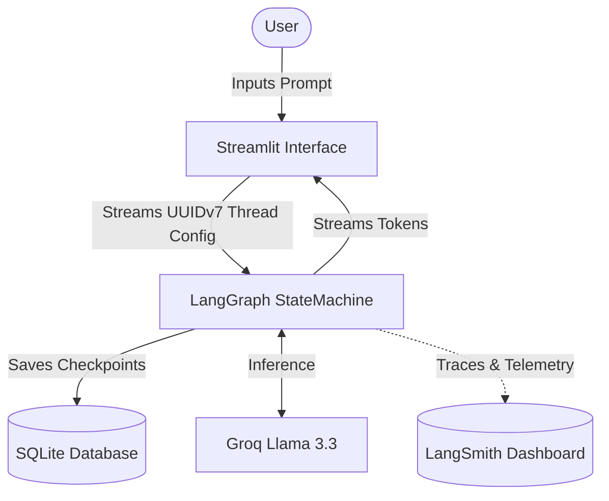

# 🤖 Agentic AI Chatbot with Stateful Orchestration

[](https://www.python.org/downloads/)
[](https://github.com/langchain-ai/langgraph)
[](https://streamlit.io/)
[](https://smith.langchain.com/)
[](https://opensource.org/licenses/MIT)

## 📌 Executive Summary (For Recruiters & Hiring Managers)

Welcome to my portfolio project! This repository demonstrates my ability to design and build **production-ready Generative AI applications**. 

Unlike standard "wrapper" chatbots, this application utilizes **LangGraph** to create a highly sophisticated, state-aware orchestration layer. It features robust conversational memory that persists across server reboots (using SQLite), real-time low-latency token streaming, and comprehensive telemetry/observability via **LangSmith**. 

This project reflects my understanding of AI system architecture, backend orchestration, frontend integration, and production best practices.

---

## 🏗️ Technical Architecture (For Engineers)

The application separates concerns between a Python-based Streamlit frontend and a highly modular LangGraph backend.

- **Orchestration Layer (`LangGraph`)**: Manages the cyclic state machine, allowing the LLM to route decisions, parse messages, and maintain state without overwhelming the context window.
- **Persistence Layer (`SQLite`)**: Implements `SqliteSaver` to automatically snapshot the graph's state at each superstep, enabling bulletproof multi-thread conversation history.
- **Inference (`Groq & Llama 3.3`)**: Utilizes Groq's LPU architecture for near-instantaneous token generation.
- **Observability (`LangSmith`)**: Injects metadata (`session_id`, `conversation_id`) directly into the `RunnableConfig` to trace execution paths, analyze token costs, and monitor latency in real-time.



---

## 🌟 Key Features

- **State-Aware Memory**: Recover the exact context, state, and history of any user session simply by switching the `thread_id`.
- **Low-Latency Streaming**: Asynchronous, real-time message streaming for a fluid user experience.
- **Production Observability**: Fully integrated with LangSmith to track every LLM invocation, monitor costs, and group conversations by unique UUIDv7 threads.
- **Clean Architecture**: Strong separation between the UI presentation (`app.py`) and the business/AI logic (`backend.py`).

---

## 🚀 Getting Started

### 1. Prerequisites
- Python 3.10+
- A [Groq API Key](https://console.groq.com/)
- A [LangSmith API Key](https://smith.langchain.com/)

### 2. Installation
Clone the repository and install the required dependencies:
```bash
git clone https://github.com/Zahir-Ahmad9897/AgenticAi-Using-LangGraph.git
cd AgenticAi-Using-LangGraph/Chatbot
pip install -r requirements.txt
```

### 3. Environment Configuration
Create a `.env` file in the root directory and configure your keys:
```env
GROQ_API_KEY=your_groq_api_key_here

# LangSmith Configuration
LANGCHAIN_TRACING_V2="true"
LANGCHAIN_ENDPOINT="https://api.smith.langchain.com"
LANGCHAIN_API_KEY="your_langsmith_api_key_here"
LANGCHAIN_PROJECT="Smart Chatbot"
```

### 4. Running the Application
Launch the production Streamlit application:
```bash
streamlit run app.py
```

---

## 📁 Repository Structure

I believe in showing the learning process. The repository is structured to separate production code from educational progression scripts:

- `app.py`: The main production Streamlit UI featuring native dark-mode and LangSmith thread grouping.
- `backend.py`: The production LangGraph orchestration, LLM configuration, and SQLite persistence logic.
- `historical_versions/`: A directory documenting the step-by-step learning progression of this application. It shows the evolution from a basic UI, to real-time streaming, and finally to advanced stateful orchestration.
- `requirements.txt`: Python package dependencies.

---

## 📈 Future Roadmap

- [x] Integrate SQLite Checkpoint Persistence
- [x] Integrate LangSmith Telemetry & UUIDv7 Threading
- [ ] Implement Tool Calling (e.g., Web Search, Calculator)
- [ ] Implement Multi-Agent Collaboration Nodes
- [ ] Add RAG (Retrieval-Augmented Generation) Capabilities

---

*Developed with a focus on modern Agentic AI principles, scalability, and clean code.*
