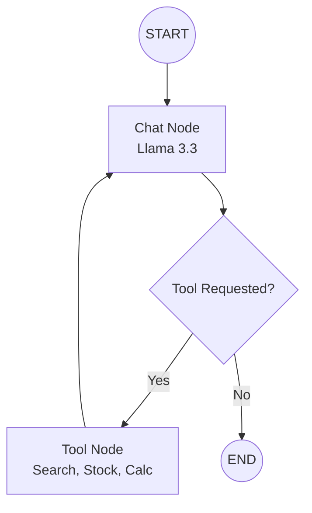

# 🤖 Agentic AI Chatbot with Multi-Tool Orchestration

[](https://www.python.org/downloads/)
[](https://github.com/langchain-ai/langgraph)
[](https://groq.com/)
[](https://streamlit.io/)
[](https://smith.langchain.com/)

A high-performance, tool-augmented agentic chatbot architecture leveraging **LangGraph** for cycle-aware orchestration, **Groq** for high-speed inference, and **SQLite** for robust thread-level persistence.

## 🌟 Key Features

-   **🧠 State-Machine Orchestration**: Built on LangGraph, the agent uses a state-machine architecture to handle cyclic workflows and tool-calling loops.
-   **🛠️ Multi-Tool Integration**:
    -   **Web Search**: Real-time information retrieval via DuckDuckGo.
    -   **Market Intelligence**: Live stock data via Alpha Vantage API.
    -   **Computational Engine**: Deterministic arithmetic tool for precise calculations.
-   **💾 Persistence Layer**: Native SQLite integration using `SqliteSaver` for session-based memory and thread recovery.
-   **⚡ High-Speed Inference**: Powered by Llama 3.3 (70B) on Groq's LPU architecture.
-   **📊 Enterprise Observability**: Integrated with LangSmith for full trace telemetry and debugging.

---

## 🏗️ Technical Architecture

The system utilizes a cyclic graph where the LLM acts as the decision-maker (`Chat_node`), determining whether to respond directly to the user or call a specialized tool.



---

## 🚀 Deployment Guide

### 1. Environment Setup
Clone the repository and install dependencies within a virtual environment.
```bash
git clone https://github.com/Zahir-Ahmad9897/AgenticAi-Using-LangGraph.git
cd AgenticAi-Using-LangGraph/Chatbot
python -m venv venv
source venv/bin/activate  # Windows: venv\Scripts\activate
pip install -r requirements.txt
```

### 2. Configuration (`.env`)
Create a `.env` file in the root directory:
```env
GROQ_API_KEY="your_groq_api_key"
LANGCHAIN_TRACING_V2="true"
LANGCHAIN_API_KEY="your_langsmith_api_key"
LANGCHAIN_PROJECT="Agentic Chatbot v2"
ALPHA_VANTAGE_API_KEY="your API key"

```

### 3. Launch Application
```bash
streamlit run app.py
```

---

## 📈 Evolution of the Project

This project represents a journey from basic LLM interactions to sophisticated agentic workflows.
-   **Phase 1**: Initial UI setup and simple LLM calls.
-   **Phase 2**: Implementation of `SqliteSaver` for persistent chat threads.
-   **Phase 3**: **Manual Tool Experimentation** (Detailed in `historical_versions/Tools_in__LangGraph.ipynb`).
-   **Phase 4 (Current)**: Full integration of an automated tool-calling graph with streaming UX.

---

## 👨‍💻 Engineering Standards
-   **Modular Design**: Backend logic decoupled from UI state.
-   **Clean Code**: Adherence to PEP 8, descriptive naming, and type hinting.
-   **Robust Error Handling**: Graceful degradation when external APIs (Stock/Search) fail.

---

## 🤝 Contact
**Zahir Ahmad**
[GitHub](https://github.com/Zahir-Ahmad9897) | [LinkedIn](https://www.linkedin.com/in/zahir-ahmad9897/)
